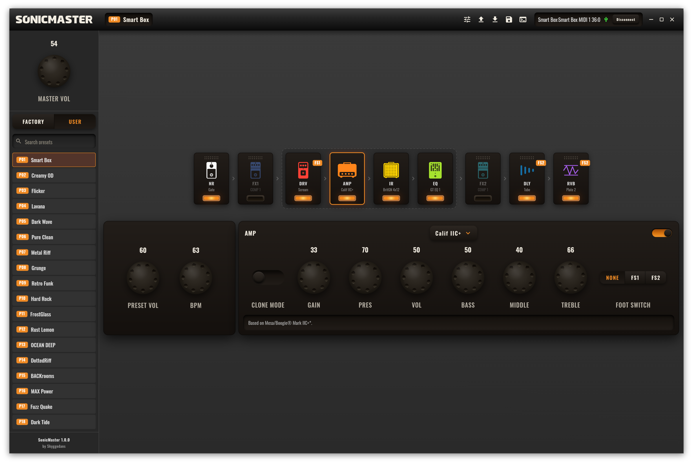

# SonicMaster

**SonicMaster** is a native desktop editor that gives you deep, real-time control over the
**Sonicake Pocket Master** and **Sonicake Smart Box** multi-effects pedals. Browse and manage
presets, edit every effect, reshape your signal chain, map footswitches, and load your own
amp captures and cabinets — all from one fast, fully offline app.

It began as a side project and is written **≈99.9% by AI**. The remaining 0.1% is the stubborn
human work: reverse-engineering the device protocol by hand, reading BLE/HCI and USB-MIDI
packet captures until the pedal gave up its secrets.



---

## Supported devices & connections

SonicMaster auto-detects your hardware on connect and tailors the editable effect set to it.

### Devices

| Device | |
| --- | --- |
| **Sonicake Pocket Master** | Full editing; effect choices per module are gated to the model's capabilities. |
| **Sonicake Smart Box** | Full editing; the larger, superset effect set. |

### Connection interfaces

Connect over either transport, with live **two-way sync** — parameters you change in the app
land on the pedal instantly, and edits made on the pedal itself show up in the app.

| Interface | |
| --- | --- |
| **USB-MIDI** | Recommended. Plug in and go. |
| **Bluetooth LE (BLE-MIDI)** | Wireless. Automatically reconnects if the link drops. |

---

## Features

* **Real-time editing** — tweak any parameter and hear the change on your device immediately.
* **Two-way communication** — changes made directly on the pedal are reflected live in the editor.
* **Full preset management** — browse, search, and load all **50 Factory** and **50 User** presets with a click.
* **Visual signal chain** — see the whole chain at a glance; click a module to edit it, and **drag to reorder** the movable modules (NR, FX1, FX2, DLY, RVB).
* **A deep model library** — swap any module's type from a dropdown, drawing on **130+ models** of classic amps, cabinets, overdrives, distortions, fuzzes, modulation, delay, and reverb.
* **Footswitch mapping** — assign modules to the pedal's FS1 / FS2 switches (see below).
* **NAM amp profiles** — import and convert your own captures (see below).
* **Custom cabinets** — load your own `.wav` impulse responses.
* **Tap tempo & BPM** — set a per-preset tempo, with note divisions (1/8, dotted 1/8, 1/4, 1/2) for delay times.
* **Master & preset volume** — one global level plus per-preset trim.
* **Automatic sync on connect** — preset names, effect types, user IRs, user profiles, and global settings are pulled from the hardware so the editor always matches your pedal.
* **Unsaved-change guard** — an edited preset is marked, and the app warns you before you switch away without saving.
* **Instant, reliable saves** — precise CRC-8 preset writing (no brute-forcing).
* **Log panel** — manual sync buttons and a raw communication log for troubleshooting.

---

## Footswitch support

The pedal has two assignable footswitches, **FS1** and **FS2**, and each can toggle **up to
three modules at once**. In SonicMaster every module carries a **None / FS1 / FS2** selector,
and its current assignment is shown as a **corner badge** on the module card — so you can build
and read your entire stomp layout at a glance, then sync it to the pedal.

---

## NAM amp profiles (Clone Mode)

The **AMP** module has a **Clone Mode** that plays a captured amp model instead of a built-in
voicing. SonicMaster takes a standard **NAM (Neural Amp Modeler) `.nam`** profile and converts
it — **entirely on your machine, with no vendor tools or DLLs** — into the pedal's native `.clo`
clone model, then uploads it into one of the five **User Profile** slots.

The conversion runs a WaveNet inference plus a Wiener–Hammerstein post-filter design in native
(Rust) DSP, reproducing the amp's response on the hardware's own clone engine.

### Supported capture formats

| Format | Status |
| --- | --- |
| **NAM WaveNet** — standard (`v0.5.x` – `v0.7.x`) | ✅ Imported & converted |
| **NAM WaveNet** inside a `SlimmableContainer` (Tone3000, `v0.7.0`) | ✅ Uses the highest-quality WaveNet inside |
| NAM **LSTM** / other architectures | ❌ Not convertible to this hardware |

`.nam` files are the standard captures shared on ToneHunt, Tone3000, and similar sites — drop
one in and it becomes a slot on your pedal.

---

## Cabinets, impulse responses & presets

| Data | Format | Destination |
| --- | --- | --- |
| **Amp captures** | NAM `.nam` (WaveNet) → converted to `.clo` | User Profile 1–5 |
| **Cabinets / IRs** | `.wav` impulse responses | User IR 1–5 |
| **Presets** | `.json` (import / export) | User bank |

Presets import and export as plain **JSON**, so you can back them up, share them, and
version-control your tones in an open format.

---

## Getting started

1. Connect your **Pocket Master** or **Smart Box** over USB, or power it on for Bluetooth.
2. Launch SonicMaster and click **Connect**.
3. Pick the **USB-MIDI** port, or choose **Bluetooth** and pair with **"Sonic Master BLE"**.
4. Wait for the initial sync overlay to finish — then start editing.

### Using the editor

* **Load a preset** — click any entry in the Factory / User lists in the sidebar.
* **Edit a module** — click a module in the chain to open its controls below.
* **Change a model** — use the module's type dropdown (e.g. swap a *Scream* overdrive for a *Red Fuzz*).
* **Reorder the chain** — drag the movable modules (NR, FX1, FX2, DLY, RVB) into a new order.
* **Save** — edited presets show a marker; save to write your changes back to the pedal.

---

## Platforms

Desktop: **Windows**, **Linux**, and **macOS** — shipped as a Windows installer, a Linux
AppImage / tarball, and a macOS `.dmg`.

### Building from source

```bash
cd app
flutter pub get
flutter run -d linux   # or: macos | windows
```

Requires the **Flutter** SDK and a **Rust** toolchain (for the native NAM→`.clo` DSP bridge).

---

## Made with AI

SonicMaster is, by design, **≈99.9% AI-written**. The other 0.1% is the hands-on part AI can't
do for you: capturing BLE/HCI and USB-MIDI traffic and reverse-engineering the Pocket Master /
Smart Box protocol frame by frame.

> Not affiliated with, or endorsed by, Sonicake. All product, amp, and pedal names are
> trademarks of their respective owners and are used only to describe the modeled gear.

## License

Code is released under the **MIT License** (see [LICENSE](LICENSE)). The bundled **Oswald**
font is licensed under the **SIL Open Font License 1.1** — see
[THIRD_PARTY_NOTICES.md](THIRD_PARTY_NOTICES.md).
